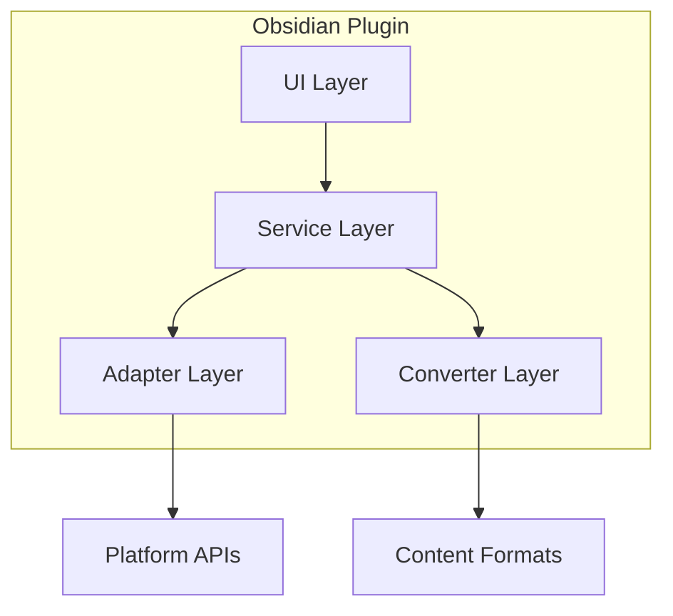
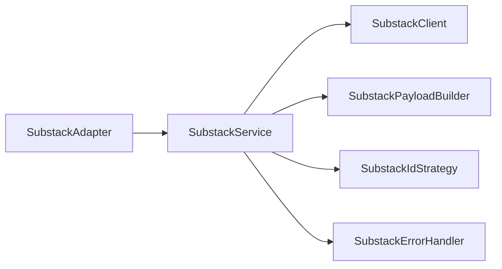

# SmartWrite Publisher - Architecture Documentation

**Project Version**: v1.0.0  
**Documentation Date**: 2026-02-02  
**Author**: Zander Catta Preta

---

## 1. Overview

SmartWrite Publisher is an Obsidian plugin that enables direct publishing of markdown notes to blogging platforms such as Substack, Medium, and WordPress. The project employs a modular architecture following object-oriented design principles and design patterns to facilitate maintenance and extensibility.

### 1.1 System Objectives

- **Automate publishing**: Eliminate copy/paste workflow between Obsidian and blogging platforms
- **Multi-platform support**: Publish to multiple platforms from a single source
- **Batch processing**: Enable bulk publishing of multiple notes
- **Seamless user experience**: Native integration with Obsidian interface

### 1.2 Current Scope

**Implemented (v1.0.0)**:

- Substack publishing (draft and live)
- Batch publishing (drafts only)
- Markdown to Tiptap JSON conversion
- Sidebar interface integration
- Logging and visual feedback system
- File selection and sorting

**In development/planned**:

- Complete Medium and WordPress support
- Cross-platform GUI installer
- Post scheduling
- Analytics dashboard per platform

---

## 2. High-Level Architecture

### 2.1 Layered View



### 2.2 Core Components

| Component              | Responsibility                                | Files                                |
| ---------------------- | --------------------------------------------- | ------------------------------------ |
| **Main Plugin**        | Manage lifecycle, settings, view registration | `main.ts`                            |
| **Publisher View**     | Sidebar UI, user interactions                 | `view.ts`                            |
| **Platform Manager**   | Orchestrate multiple adapters                 | `core/PlatformManager.ts`            |
| **Platform Adapters**  | Implement platform-specific integration       | `substack/`, `medium/`, `wordpress/` |
| **Markdown Converter** | Convert markdown to platform formats          | `converter.ts`                       |
| **Logger**             | Internal logging system                       | `logger.ts`                          |
| **UI Components**      | Modals, progress bars, loading managers       | `ui/`                                |

---

## 3. Service Layer

### 3.1 Platform Manager

**File**: `src/core/PlatformManager.ts`

**Pattern**: Registry Pattern

```typescript
class PlatformManager {
	private adapters: Map<string, BlogPlatformAdapter>;

	register(adapter: BlogPlatformAdapter): void;
	getAdapter(platform: string): BlogPlatformAdapter;
	publishToMultiple(
		platforms: string[],
		post: UniversalPost,
	): Promise<Results>;
}
```

**Responsibilities**:

- Register and manage platform adapters
- Orchestrate multi-platform publishing
- Centralize credential configuration

### 3.2 Blog Platform Adapter (Interface)

**File**: `src/core/BlogPlatformAdapter.ts`

**Pattern**: Adapter Pattern

```typescript
interface BlogPlatformAdapter {
	// Metadata
	name: string;
	displayName: string;

	// Authentication
	configure(config: any): void;
	testConnection(): Promise<ConnectionTestResult>;

	// Publishing
	createDraft(post: UniversalPost): Promise<PublishResult>;
	publishPost(post: UniversalPost): Promise<PublishResult>;

	// Capabilities
	getPlatformCapabilities(): PlatformCapabilities;
}
```

**Implementations**:

- `SubstackAdapter` (complete)
- `MediumAdapter` (in development)
- `WordPressAdapter` (in development)

### 3.3 Substack Service (Modular Architecture)

**Directory**: `src/substack/`

#### Substack Service Components



**SubstackClient**: HTTP wrapper with correct headers and cookie normalization

**SubstackPayloadBuilder**: Factory pattern for API payload construction (Draft/Publish)

**SubstackIdStrategy**: Strategy pattern for publication_id and user_id discovery

**SubstackErrorHandler**: Centralized error handling with actionable messages

**SubstackService**: Orchestrator using all components above

---

## 4. Conversion Layer

### 4.1 Markdown Converter

**File**: `src/converter.ts`

**Responsibilities**:

- Extract title (first H1)
- Extract subtitle (first paragraph after title)
- Convert markdown to HTML
- Convert markdown to Tiptap JSON (Substack format)
- HTML escape (XSS security)

**Supported Formats**:

- Headings (H1-H6)
- Text formatting (bold, italic, strikethrough)
- Links
- Lists (ordered/unordered)
- Code blocks
- Blockquotes
- Images

**Limitations**:

- Obsidian wikilinks not supported (use markdown links)
- Obsidian callouts converted to blockquotes
- Embedded files not supported
- Dataview queries not supported

### 4.2 Tiptap JSON Format

Substack uses Tiptap (WYSIWYG editor) internally. The converter implements direct conversion to this format:

```typescript
interface TiptapDocument {
	type: "doc";
	content: TiptapNode[];
}

interface TiptapNode {
	type: string; // 'paragraph', 'heading', 'text'
	attrs?: any;
	content?: TiptapNode[];
	text?: string;
	marks?: TiptapMark[];
}
```

---

## 5. UI Layer

### 5.1 Publisher View

**File**: `src/view.ts`

**Type**: `ItemView` (Obsidian API)

#### UI Sections

1. **Header**: Logo + version
2. **Active Note**: Single note publishing (Draft/Live)
3. **Batch Publishing**: Folder selection and bulk publishing
4. **Connection Status**: Visual connection indicator (green/red)
5. **System Logs**: Log console with copy/clear functionality

#### UX Features

- **Loading states**: Spinners and overlays during async operations
- **Progress tracking**: Progress indicators for batch operations (1/10, 2/10...)
- **Results modal**: Success/failure summary after batch operations
- **File selection modal**: Checkboxes for file selection
- **Folder browse modal**: Folder navigation with autocomplete
- **Collapsible sections**: Expandable sections for UI organization

### 5.2 UI Components (Reusable)

**Directory**: `src/ui/`

| Component            | Purpose                   |
| -------------------- | ------------------------- |
| `BaseModal`          | Base class for all modals |
| `LoadingManager`     | Manage loading states     |
| `ProgressBar`        | Animated progress bars    |
| `FolderBrowseModal`  | Folder selection modal    |
| `FileSelectionModal` | File selection modal      |
| `BatchResultsModal`  | Batch results modal       |

**Pattern**: Template Method Pattern (BaseModal)

---

## 6. Data Flow

### 6.1 Single Note Publishing

```
User clicks "Create draft"
    ↓
PublisherView.handlePublish(isDraft: true)
    ↓
Get active file from Obsidian
    ↓
Read file content
    ↓
MarkdownConverter.convert(markdown)
    ├─ Extract title (H1)
    ├─ Extract subtitle (first paragraph)
    └─ Convert to Tiptap JSON
    ↓
PlatformManager.publish('substack', post)
    ↓
SubstackAdapter.createDraft(post)
    ↓
SubstackService.publishPost(...)
    ├─ SubstackPayloadBuilder.buildDraftPayload()
    ├─ SubstackClient.post('/api/v1/drafts')
    └─ SubstackErrorHandler.handle(error)
    ↓
Update UI (success notice / error message)
```

### 6.2 Batch Publishing

```
User selects folder
    ↓
PublisherView.handleBatchPublish(folderPath)
    ↓
Get all .md files in folder
    ↓
Show FileSelectionModal
    ├─ User selects files with checkboxes
    └─ User can sort (A-Z / Z-A)
    ↓
User confirms selection
    ↓
For each selected file (parallel, 3 at a time):
    ├─ Read file content
    ├─ Convert markdown
    ├─ Publish as draft
    ├─ Track result (success/failure)
    └─ Sleep 1.5s between batches (rate limiting)
    ↓
Show BatchResultsModal
    ├─ Total files processed
    ├─ Success count
    └─ Failure count with error details
```

### 6.3 Connection Test

```
User clicks "Test Connection" or changes credentials
    ↓
SmartWritePublisher.testConnection()
    ↓
SubstackAdapter.testConnection()
    ↓
SubstackIdStrategy.discoverIds()
    ├─ Try /api/v1/publication (publication info)
    ├─ Try /api/v1/user/self (user info)
    └─ Try /api/v1/posts (fallback)
    ↓
Return ConnectionTestResult
    ├─ success: boolean
    ├─ publicationId: number
    └─ message: string
    ↓
Update UI indicator (green dot / red dot)
```

---

## 7. State Management

### 7.1 Plugin Settings

**File**: `src/settings.ts`

**Storage**: `.obsidian/plugins/smartwrite-publisher/data.json`

```typescript
interface SmartWriteSettings {
	cookies: string; // Substack session cookie
	substackUrl: string; // publication.substack.com
	mediumApiKey: string; // Medium integration token
	wordpressConfig: {
		url: string;
		username: string;
		appPassword: string;
	};
}
```

### 7.2 Runtime State

**Managed by**:

- `PublisherView` (UI state: active note, connection status)
- `Logger` (log entries array)
- `PlatformManager` (registered adapters)

**Caching**:

- Folder list cache (TTL: 60s) - performance optimization

---

## 8. Error Handling

### 8.1 Error Handling Strategy

**Principles**:

1. **Fail gracefully**: Never crash the plugin
2. **Actionable messages**: Tell user how to fix issues
3. **Detailed logging**: Record complete context for debugging

### 8.2 Error Types

| HTTP Error | Cause                    | User Message                                             |
| ---------- | ------------------------ | -------------------------------------------------------- |
| 401        | Invalid/expired cookie   | "Authentication failed. Please update your cookie..."    |
| 403        | Insufficient permissions | "Permission denied. Check URL and publication access..." |
| 404        | Endpoint not found       | "API endpoint not found. Check Substack URL..."          |
| 429        | Rate limiting            | "Too many requests. Wait 60s and try again..."           |
| 500+       | Server error             | "Server error. This is not your fault. Try later..."     |

### 8.3 Batch Error Handling

**Strategy**: Individual error isolation

- Each file is processed independently
- Failure in one file doesn't stop the batch
- All errors are collected and presented in results modal
- Detailed logs for each failure

---

## 9. Performance and Optimizations

### 9.1 Implemented Optimizations

**Parallel Batch Publishing** (v0.4.0):

- Processes 3 files simultaneously
- 3x faster than sequential processing
- Rate limiting maintained (1.5s between batches)

**Folder Caching**:

- Folder list cache (TTL: 60s)
- 10x faster than reading vault every time
- Forced refresh when needed

**Partial Rendering**:

- Updates only changed elements
- Avoids complete sidebar re-render
- Improves UI responsiveness

### 9.2 Performance Metrics

| Operation       | Before (v0.3.x) | After (v0.4.0) | Improvement |
| --------------- | --------------- | -------------- | ----------- |
| Batch (9 files) | ~15s            | ~5s            | 3x          |
| Folder list     | ~50ms           | ~5ms           | 10x         |
| UI update       | ~100ms          | ~10ms          | 10x         |

---

## 10. Security

### 10.1 Security Considerations

**Cookie Storage**:

- Stored in `data.json` (not encrypted)
- User must protect vault
- Cookie has natural expiration (~30 days)

**XSS Prevention**:

- HTML escape in converter
- Use of `textContent` instead of `innerHTML`
- User input validation

**API Security**:

- Correct headers (User-Agent, Content-Type)
- Cookie normalization (decode URL encoding)
- Response validation before use

### 10.2 Recommended Best Practices

1. **Don't share cookie**: Equivalent to password
2. **Don't commit to Git**: Add `data.json` to `.gitignore`
3. **Rotate periodically**: Logout/login to renew cookie
4. **Use drafts by default**: Review before publishing

---

## 11. Extensibility

### 11.1 Adding a New Platform

**Steps**:

1. Create adapter implementing `BlogPlatformAdapter`
2. Implement interface methods
3. Register in `PlatformManager`
4. Add platform-specific settings
5. Update UI with checkbox/options

**Example**: Medium Adapter (in development)

```typescript
class MediumAdapter implements BlogPlatformAdapter {
    name = 'medium'
    displayName = 'Medium'

    configure(config: { apiKey: string }): void { ... }
    testConnection(): Promise<ConnectionTestResult> { ... }
    createDraft(post: UniversalPost): Promise<PublishResult> { ... }
    publishPost(post: UniversalPost): Promise<PublishResult> { ... }
}
```

### 11.2 Adding a New Conversion Format

Extend `MarkdownConverter.convert()` with new format:

```typescript
private convertToFormat(markdown: string, format: 'html' | 'tiptap' | 'medium'): any {
    switch (format) {
        case 'tiptap':
            return this.convertToTiptapJSON(markdown)
        case 'medium':
            return this.convertToMediumFormat(markdown)
        default:
            return this.convertToHtml(markdown)
    }
}
```

### 11.3 Adding a New UI Component

Create class extending `BaseModal`:

```typescript
class MyCustomModal extends BaseModal<MyResult> {
	onOpen() {
		// Render custom content
	}
}
```

---

## 12. Technologies and Dependencies

### 12.1 Technology Stack

| Technology       | Version | Purpose          |
| ---------------- | ------- | ---------------- |
| **TypeScript**   | 5.8.3   | Primary language |
| **Obsidian API** | latest  | Plugin framework |
| **esbuild**      | 0.25.5  | Bundler          |
| **ESLint**       | 8.35.1  | Linting          |

### 12.2 Dependencies

**Production**:

- `obsidian`: Obsidian API

**Development**:

- `typescript`: Compiler
- `esbuild`: Build tool
- `eslint`: Code quality
- `@types/node`: Type definitions

### 12.3 Build System

**File**: `esbuild.config.mjs`

**Process**:

1. TypeScript → JavaScript (via esbuild)
2. Bundle modules → `dist/main.js`
3. Copy `manifest.json` and `styles.css` to `dist/`
4. Development mode: auto-copy to vault

**Scripts**:

```bash
npm run dev         # Build watch mode + copy to vault
npm run build       # Production build
npm run lint        # ESLint check
```

---

## 13. Testing

### 13.1 Testing Strategy

**Current**:

- Manual testing in development vault
- Feature checklist after each release

**Planned (v1.2.0+)**:

- Unit tests for converters
- Integration tests for adapters
- E2E tests with test vault

### 13.2 Manual Testing Checklist

- Single note publish (draft)
- Single note publish (live)
- Batch publishing (5 files)
- File selection (check/uncheck)
- File sorting (A-Z / Z-A)
- Folder browse modal
- Connection test
- Error handling (401, 404, 500)
- Logs copy/clear

---

## 14. Deployment

### 14.1 Release Process

**File**: `scripts/release.sh`

**Steps**:

1. Bump version in `manifest.json` and `package.json`
2. Update `versions.json`
3. Build production bundle
4. Create Git tag
5. Push to GitHub
6. Create GitHub Release with assets

**Automation**:

```bash
npm run release        # Interactive release
npm run release:auto   # Auto-detect version bump
npm run release:dry    # Dry run (test)
```

### 14.2 Distribution

**Manual Installation**:

1. Download release ZIP from GitHub
2. Extract to `.obsidian/plugins/smartwrite-publisher/`
3. Enable plugin in Obsidian settings

**GUI Installer** (planned v1.2.0):

- Electron app for multiple platforms
- Auto-detect Obsidian vaults
- One-click installation
- Windows, macOS, Linux

---

## 15. Architecture Roadmap

### 15.1 Next Improvements (v1.2.0)

**Multi-Platform Manager**:

- Complete Medium and WordPress support
- Simultaneous publishing to multiple platforms
- Per-platform settings

**Content Sync**:

- Post synchronization between platforms
- Change detection in notes
- Update existing published posts

**GUI Installer**:

- Standalone Electron app
- Vault auto-detection
- Automated plugin installation

### 15.2 Future Improvements (v1.3.0+)

**Analytics Dashboard**:

- Performance comparison per platform
- Published post tracking
- Engagement metrics

**Advanced Scheduling**:

- Local post scheduling
- Calendar integration
- Timezone handling

**Template System**:

- Platform-specific templates
- Automatic transformations
- Frontmatter mapping

---

## 16. Conclusion

SmartWrite Publisher is architected with **modularity**, **extensibility**, and **user experience** as core principles. The current architecture supports organic growth through the adapter pattern, allowing new platforms to be added without modifying core code.

### 16.1 Architecture Strengths

- **Separation of concerns**: Each component has a clear role
- **Reusability**: Shared UI components, modals, and services
- **Type safety**: TypeScript throughout codebase
- **Robust error handling**: Graceful failures with actionable feedback
- **Optimized performance**: Caching and parallel processing

### 16.2 Areas for Improvement

- **Testing**: Add automated tests
- **Documentation**: JSDoc for all public methods
- **Observability**: Integrated metrics and analytics
- **Configuration**: More intuitive settings UI

---

**Documentation maintained by**: Zander Catta Preta  
**Last updated**: 2026-02-02  
**Document version**: 1.0
