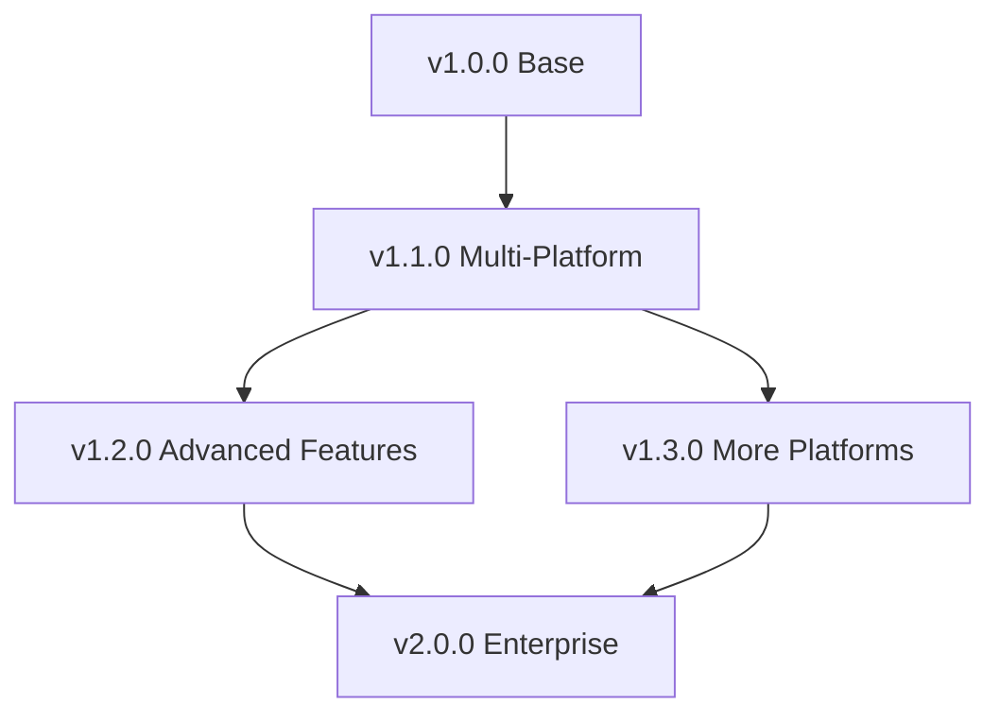

# SmartWrite Publisher - Development Roadmap

**Current Version**: v1.0.1  
**Date**: 2026-02-02  
**Author**: Zander Catta Preta

---

## Overview

This roadmap defines the planned evolution of SmartWrite Publisher, organizing features and improvements into development phases with priorities and estimated timelines.

---

## v1.0.0: Solid Foundation (COMPLETED - 2026-02-01)

### Status: Initial Public Release

### Main Deliverables

**Substack Publishing**

- Single note publishing (Draft/Live)
- Batch publishing (Drafts only for safety)
- Markdown to Tiptap JSON conversion
- File selection with checkboxes
- File sorting (A-Z / Z-A)
- Real-time progress tracking
- Results modal with success/failure summary

**User Experience**

- Native Obsidian sidebar integration
- Loading states and spinners
- Collapsible sections
- System logs with copy/clear
- Connection status indicator (green/red)
- Actionable error messages

**Modular Architecture**

- Platform Adapter pattern implemented
- SubstackService with separated components:
    - SubstackClient (HTTP wrapper)
    - SubstackPayloadBuilder (Factory pattern)
    - SubstackIdStrategy (Strategy pattern)
    - SubstackErrorHandler (Centralized error handling)
- Reusable UI Components (Modals, LoadingManager, ProgressBar)

**Performance**

- Parallel batch publishing (3x faster)
- Folder caching (10x faster)
- Partial rendering

**Complete Documentation**

- USER_GUIDE.md (744 lines)
- API_DOCUMENTATION.md (940 lines)
- FAQ.md
- TROUBLESHOOTING.md
- CONTRIBUTING.md

### Success Metrics

- Build without TypeScript errors
- Zero breaking changes for v0.x users
- Batch of 9 files in ~5s (previously: ~15s)
- Code duplication < 5% (previously: 30%)

---

## v1.1.0: Professional Release - Medium and WordPress (PLANNED)

### Status: Planned - Q1 2026

### Estimated Timeline: 6-8 weeks

### Objectives

Expand multi-platform capabilities and professionalize distribution tools.

### Planned Features

#### 1. Medium Integration (Priority: High)

**Tasks**:

- Implement complete MediumAdapter
    - Authentication via Integration Token
    - Draft creation API
    - Publishing API
    - Tag mapping
    - Image upload
- Convert markdown to Medium format
- Medium settings UI
- Connection test for Medium
- Medium-specific error handling

**Estimated Effort**: 5-7 sessions

#### 2. WordPress Integration (Priority: High)

**Tasks**:

- Implement complete WordPressAdapter
    - REST API authentication (Application Password)
    - Post/Draft creation API
    - Category and tag support
    - Featured image upload
    - Custom post types support
- Convert markdown to WordPress blocks (Gutenberg)
- WordPress settings UI
- Multi-site support
- WordPress-specific error handling

**Estimated Effort**: 7-9 sessions

#### 3. Cross-Platform GUI Installer (Priority: Medium)

**Tasks**:

- Electron base app
    - Window management
    - Auto-updater
    - Platform detection (Windows/macOS/Linux)
- Vault detection
    - Search standard locations
    - Read Obsidian's recent vaults
    - Manual vault selection
- Plugin installation
    - Download release assets
    - Extract and copy files
    - Auto-enable plugin
- Installer UI
    - Vault selection screen
    - Progress indicators
    - Success/error screens
- Packaging
    - .exe for Windows
    - .dmg for macOS
    - .AppImage for Linux

**Estimated Effort**: 8-10 sessions

#### 4. Code Refactoring and Optimizations (Priority: Medium)

**Tasks**:

- Remove redundant code
- Optimize rendering performance
- Improve error messages
- Add JSDoc to all public methods
- Smoother loading animations
- Reduce bundle size

**Estimated Effort**: 3-4 sessions

### Acceptance Criteria v1.1.0

- Medium: Successfully publish draft and live
- WordPress: Successfully publish draft and live
- GUI Installer: Install plugin in 1 click
- All platforms: Connection test passes
- Performance: No regressions vs v1.0.0
- Documentation: Updated with Medium and WordPress

### Success Metrics

- Medium adapter covers 80%+ of use cases
- WordPress adapter supports standard posts + custom types
- GUI Installer works on Windows, macOS, Linux
- Installation time < 2 minutes

---

## v1.2.0: Advanced Publishing Features (BACKLOG)

### Status: Planned - Q2 2026

### Estimated Timeline: 8-10 weeks

### Planned Features

#### 1. Simultaneous Multi-Platform Publishing

**Description**: Publish to multiple platforms simultaneously

**Tasks**:

- UI to select multiple platforms
- PlatformManager.publishToMultiple()
- Parallel publishing with Promise.all()
- Aggregated results modal (per platform)
- Per-platform error handling
- Rollback strategy (if one platform fails)

**Benefit**: Save time when publishing to 3+ platforms

#### 2. Platform-Specific Templates

**Description**: Automatically customize content per platform

**Tasks**:

- Basic template engine
- Frontmatter mapping
    - `title_substack`, `title_medium`, `title_wordpress`
    - `subtitle_*`, `tags_*`, etc.
- Conditional content blocks
    - `<!-- substack-only -->`
    - `<!-- wordpress-only -->`
- Per-platform image transformation
- Auto-replace internal links

**Benefit**: A/B testing of titles, platform-optimized content

#### 3. Analytics Dashboard (Experimental)

**Description**: Compare post performance across platforms

**Tasks**:

- Track published posts (local DB)
- Fetch analytics via APIs (when available)
- Dashboard with charts:
    - Posts published per platform
    - Engagement metrics (if available)
    - Publishing frequency
- Export reports (CSV/JSON)

**Limitation**: Depends on public analytics APIs (limited)

#### 4. Content Synchronization

**Description**: Update already published posts when note changes

**Tasks**:

- Track post IDs (mapping: note → post IDs per platform)
- Detect note changes via file watcher
- Update API for each adapter
- Conflict resolution (if edited on both sides)
- Diff preview before update

**Benefit**: Keep content synchronized, fix typos

### Acceptance Criteria v1.2.0

- Publish to 3+ platforms simultaneously
- Templates working with conditional blocks
- Analytics tracking for published posts
- Content sync updates existing posts
- Documentation for advanced features

---

## v1.3.0: Extended Platform Support (BACKLOG)

### Status: Planned - Q3 2026

### Platforms to Add

1. **Dev.to** (Priority: High)
    - Well-documented public API
    - Active developer community
    - Tag and series support

2. **Hashnode** (Priority: High)
    - GraphQL API
    - Custom domain support
    - Newsletter integration

3. **Blogger** (Priority: Medium)
    - Google Blogger API
    - Large user base
    - Simple interface

4. **Tumblr** (Priority: Low)
    - OAuth API
    - Specific niche
    - Limited markdown support

5. **LinkedIn Articles** (Priority: Medium)
    - Professional audience
    - Limited API
    - Requires OAuth

### Additional Features

- **Unified Tag System**: Tags automatically mapped between platforms
- **Image CDN Integration**: Upload images to common CDN
- **SEO Optimization**: Automatic meta tags, OG tags
- **Scheduled Publishing**: Local scheduling (where API supports)

---

## v2.0.0: Enterprise and Collaboration (FUTURE)

### Status: Long-Term Vision - 2027

### Visionary Features

#### 1. Team Collaboration

- Multi-user support
- Shared publication configs
- Draft review and approval workflow
- Comment/annotation system

#### 2. Advanced Scheduling

- Local scheduler (cron-like)
- Timezone handling
- Calendar view of scheduled posts
- Recurring posts (weekly newsletters)

#### 3. AI-Powered Features

- Auto-generate titles/subtitles
- SEO keyword suggestions
- Content optimization recommendations
- Auto-tagging based on content

#### 4. Plugin Ecosystem

- Custom adapter API
- Community-contributed adapters
- Plugin marketplace
- Hooks and extensibility points

---

## Feature Prioritization

### Priority Matrix (Impact × Effort)

```
High Impact, Low Effort:
- Medium/WordPress adapters
- Simultaneous publishing

High Impact, High Effort:
- GUI Installer
- Content sync

Low Impact, Low Effort:
- Basic templates
- SEO meta tags

Low Impact, High Effort:
- AI features (future)
- Team collaboration (future)
```

### Feature Dependencies



---

## Release Criteria

### Definition of Done (DoD) for Any Release

- Build without TypeScript errors
- ESLint passes without critical warnings
- Complete manual testing checklist
- Updated documentation (USER_GUIDE, API_DOCS)
- Updated CHANGELOG.md
- GitHub Release created with assets
- No regressions in existing features
- Performance equal to or better than previous version

### Versioning Strategy

Following **Semantic Versioning (SemVer)**:

- **MAJOR** (v2.0.0): Breaking API changes
- **MINOR** (v1.1.0): New features, backward compatible
- **PATCH** (v1.0.1): Bug fixes, minor improvements

---

## Community Feedback

### How to Influence the Roadmap

1. **GitHub Issues**: Report bugs and suggest features
2. **Discussions**: Discuss ideas and use cases
3. **Pull Requests**: Contribute code directly
4. **Voting**: Thumbs up on issues for prioritization

### Top Community Requests (Placeholder)

**Will be updated as feedback arrives**:

- Ghost platform support
- Automatic image optimization
- Bulk image upload
- Custom frontmatter mapping

---

## Risks and Mitigations

### Identified Risks

| Risk                                        | Probability | Impact | Mitigation                          |
| ------------------------------------------- | ----------- | ------ | ----------------------------------- |
| Platform APIs change                        | Medium      | High   | Adapter versioning, regular tests   |
| Performance degrades with multiple adapters | Low         | Medium | Profiling, lazy loading of adapters |
| UI complexity increases                     | High        | Medium | UX reviews, beta testing            |
| Feature fragmentation per platform          | High        | Low    | Clear capabilities documentation    |

### Contingency Plan

- **APIs break**: Maintain backward compatibility, communicate to users
- **Critical bugs**: Immediate hotfix releases
- **Features delayed**: Re-prioritize roadmap, communicate transparently

---

## Project Success Metrics

### KPIs (Key Performance Indicators)

**Adoption**:

- Total downloads (GitHub releases)
- GitHub stars
- Open vs closed issues

**Quality**:

- Bug rate (bugs per release)
- Time to fix (average days to resolve bug)
- Test coverage (goal: >70% by v2.0.0)

**Performance**:

- Batch publish time (< 2s per file)
- Plugin load time (< 500ms)
- UI responsiveness (< 100ms for actions)

**Community**:

- Active contributors
- Accepted pull requests
- Forum activity (discussions)

---

## Conclusion

The SmartWrite Publisher roadmap reflects a commitment to **quality**, **extensibility**, and **user experience**. Each version adds incremental value while maintaining stability and performance.

### Guiding Principles

1. **User first**: Features should solve real problems
2. **Backward compatibility**: Don't break existing workflows
3. **Modularity**: New features shouldn't increase core complexity
4. **Documentation**: Each feature should be well documented
5. **Performance**: Never sacrifice speed for features

---

**Roadmap maintained by**: Zander Catta Preta  
**Last updated**: 2026-02-02  
**Next review**: After v1.1.0 release

**Feedback**: Open an issue on [GitHub](https://github.com/zandercpzed/smartwrite-publisher/issues) with suggestions!
