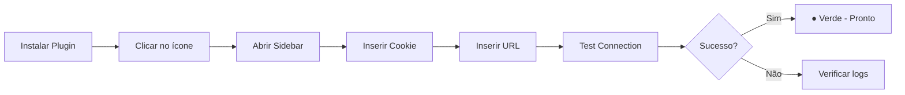
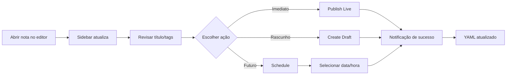
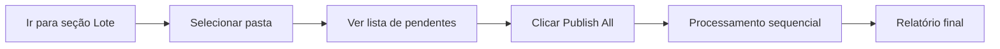

# Jornada do Usuário

Fluxos de interação com o plugin SmartWrite Publisher.

## Fluxo 1: Configuração Inicial

**Passos detalhados:**

1. Instale o plugin via Obsidian Community Plugins
2. Clique no ícone "Broadcast" na ribbon lateral
3. Na seção "Configurações Rápidas":
   - Cole o `substack.sid` do browser (DevTools → Cookies)
   - Insira a URL do seu Substack (ex: `https://seublog.substack.com`)
4. Clique em "Test Connection"
5. Se o ponto ficar verde, você está autenticado

---

## Fluxo 2: Publicar Nota Ativa

**Passos detalhados:**

1. Abra uma nota Markdown no Obsidian
2. A sidebar mostra automaticamente o nome da nota
3. Revise o título e tags sugeridas
4. Escolha a ação:
   - **Publish Live**: Publica imediatamente
   - **Create Draft**: Salva como rascunho no Substack
   - **Schedule**: Agenda para data/hora específica
5. Receba notificação de sucesso
6. A propriedade `published_at` é adicionada ao frontmatter

---

## Fluxo 3: Publicação em Lote

**Passos detalhados:**

1. Vá para a seção "Publicação em Lote" na sidebar
2. Selecione uma pasta do vault (ex: `posts/janeiro`)
3. O plugin lista todas as notas que ainda não foram publicadas
4. Clique em "Publish All"
5. O plugin processa cada arquivo sequencialmente
6. Ao final, exibe um resumo:
   - ✅ 5 publicadas com sucesso
   - ❌ 1 com erro (ver logs)

---

## Estados da Nota

| Estado | Indicador | Significado |
|--------|-----------|-------------|
| Pendente | Badge cinza | Nunca foi publicada |
| Publicado | Badge verde | Tem `published_at` no YAML |
| Erro | Badge vermelho | Falha na última tentativa |

## Obtenção do Cookie

Para autenticar, você precisa do cookie `substack.sid`:

1. Acesse [substack.com](https://substack.com) e faça login
2. Abra DevTools (F12 ou Cmd+Opt+I)
3. Vá para Application → Cookies → substack.com
4. Copie o valor de `substack.sid`
5. Cole no campo de Cookie do plugin

> **Nota**: O cookie expira periodicamente. Se a conexão falhar, obtenha um novo cookie.
